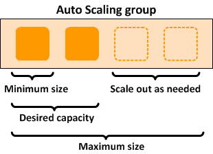

.. _autoscaling:

AWS ParallelCluster Auto Scaling
================================

The auto scaling strategy described here applies to HPC clusters deployed with one of the supported traditional
job schedulers (Grid Engine, Slurm, or Torque).
For these cases, AWS ParallelCluster implements auto scaling by managing the `Auto Scaling Group`_ (ASG) of the
compute nodes and changing the scheduler configuration accordingly.
For HPC clusters based on AWS Batch, ParallelCluster relies on the elastic scaling capabilities provided by
the AWS-managed job scheduler.

Clusters deployed with AWS ParallelCluster are elasticized by setting the ``initial_queue_size`` and ``max_queue_size``
parameters in the cluster configuration settings.
The ``initial_queue_size`` sets the minimum size value of the ComputeFleet ASG and the desired capacity value.
The ``max_queue_size`` sets the maximum size value of the ComputeFleet ASG.

Scaling Up
==========

Every minute, a process called jobwatcher_ runs on the master instance and evaluates the current number of instances
required by the pending jobs in the queue.
If the total number of busy nodes and requested nodes is greater than the current desired value in the ASG,
more instances will be added.
If additional jobs are submitted, the queue will be re-evaluated by jobwatcher_ and the ASG will be increased
up to the ``max_queue_size``.

With Grid Engine, each job requires a number of slots to run (one slot corresponds to one processing unit, e.g. a vCPU).
When evaluating the number of instances required to serve currently pending jobs that are queued, the jobwatcher divides
the total number of requested slots by the capacity of a single compute node.
The capacity of a compute node that is the number of available vCPUs depends on the EC2 instance type selected in
the cluster configuration.

With Slurm and Torque, each job can require both a number of nodes and a number of slots per node.
The jobwatcher takes into account the resources requested by each job and determines the number of compute nodes to
fulfill the new computational requirements.
For example, assuming a cluster with c5.2xlarge (8 vCPU) as the compute instance type, and three queued pending jobs
with the following requirements: job1 (2 nodes / 4 slots per job), job2 (3 nodes / 2 slots per job) and
job3 (1 node / 4 slots per job), the jobwatcher will require adding three new compute instances to the ASG to
serve the three jobs.

*Current limitation*: the auto scale-up logic does not consider partially loaded busy nodes.  Each node running a job
is considered busy even if there are empty slots.

Scaling Down
============

Each compute node runs a process called nodewatcher_ which evaluates the idle time of the node. If an instance had
no jobs for longer than ``scaledown_idletime`` (which defaults to 10 minutes) and there are no pending jobs currently
queued by the cluster, the instance is terminated.

nodewatcher_ calls the TerminateInstanceInAutoScalingGroup_ API call to remove an as long as the size of the ASG is
equal to the minimum ASG size. This permits the cluster to scale down without affecting running jobs and also enables
an elastic cluster with a fixed base number of instances.

===============
Static Clusters
===============

The value of auto scaling is the same for HPC as with any other cloud-based workload.  The only difference is that
AWS ParallelCluster has code to specifically make it interact in a more intelligent manner.  If a static cluster is
required, this can be achieved by setting ``initial_queue_size`` and ``max_queue_size`` to the required size of the
cluster and ``maintain_initial_size`` parameter to
``true.`` This will configure the ComputeFleet ASG to have the same value for minimum, maximum, and desired capacity.

.. _`Auto Scaling Group`: https://docs.aws.amazon.com/autoscaling/ec2/userguide/what-is-amazon-ec2-auto-scaling.html
.. _jobwatcher: https://github.com/aws/aws-parallelcluster-node/tree/develop/jobwatcher
.. _nodewatcher: https://github.com/aws/aws-parallelcluster-node/tree/develop/nodewatcher
.. _TerminateInstanceInAutoScalingGroup:
   http://docs.aws.amazon.com/AutoScaling/latest/APIReference/API_TerminateInstanceInAutoScalingGroup.html
