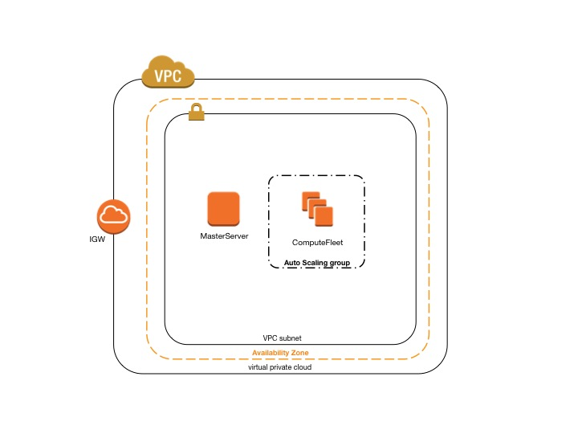
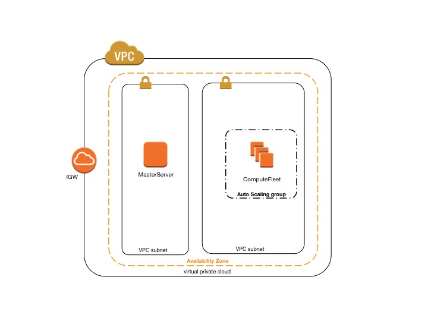
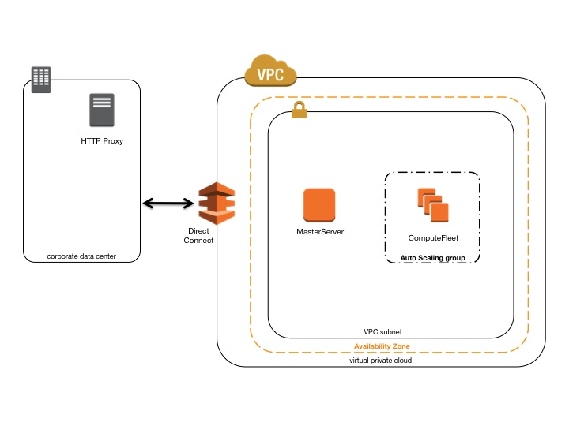
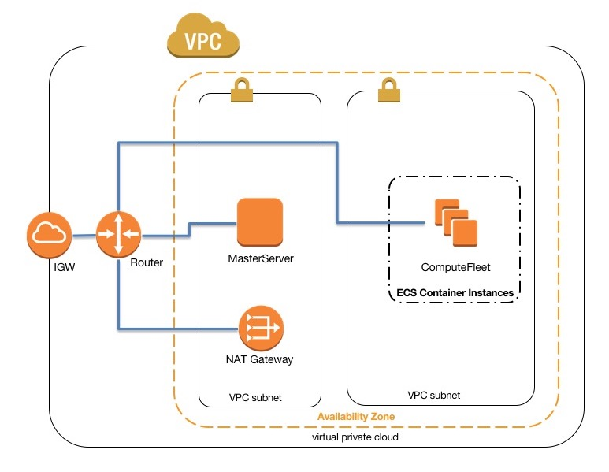

.. _networking:

Network Configurations
======================

AWS ParallelCluster leverages Amazon Virtual Private Cloud (VPC) for networking. This provides a very flexible and
configurable networking platform to deploy clusters within. AWS ParallelCluster support the following high-level
configurations:

* Single subnet for both master and compute instances
* Two subnets, master in one public subnet and compute instances in a private subnet (new or already existing)

All of these configurations can operate with or without public IP addressing.
It can also be deployed to leverage an HTTP proxy for all AWS requests.
The combinations of these configurations result in many different deployment scenarios, ranging from a single public
subnet with all access over the Internet, to fully private via AWS Direct Connect and HTTP proxy for all traffic.

Below are some architecture diagrams for some of those scenarios:

AWS ParallelCluster in a single public subnet
---------------------------------------------

The configuration for this architecture requires the following settings:

::

  [vpc public]
  vpc_id = vpc-xxxxxx
  master_subnet_id = subnet-<public>

AWS ParallelCluster using two subnets
-------------------------------------

The configuration to create a new private subnet for compute instances requires the following settings:

`note that all values are examples only`

::

  [vpc public-private-new]
  vpc_id = vpc-xxxxxx
  master_subnet_id = subnet-<public>
  compute_subnet_cidr = 10.0.1.0/24
  use_public_ips = true

The configuration to use an existing private network requires the following settings:

::

  [vpc public-private-existing]
  vpc_id = vpc-xxxxxx
  master_subnet_id = subnet-<public>
  compute_subnet_id = subnet-<private>

.. note::
    This second configuration requires a `NAT Gateway
    <https://docs.aws.amazon.com/vpc/latest/userguide/vpc-nat-gateway.html>`_
    or an internal PROXY to enable web access for compute instances.

AWS ParallelCluster in a single private subnet connected using Direct Connect
-----------------------------------------------------------------------------

The configuration for this architecture requires the following settings:

::

  [cluster private-proxy]
  proxy_server = http://proxy.corp.net:8080

  [vpc private-proxy]
  vpc_id = vpc-xxxxxx
  master_subnet_id = subnet-<private>
  use_public_ips = false

With use_public_ips set to false The VPC must be correctly setup to use the Proxy for all traffic.
Web access is required for both Master and Compute instances.

.. _awsbatch_networking:

AWS ParallelCluster with awsbatch scheduler
-------------------------------------------

When using ``awsbatch`` as scheduler type, ParallelCluster creates an AWS Batch Managed Compute Environment which takes
care of managing ECS container instances, launched in the ``compute_subnet``. In order for AWS Batch to function
correctly, Amazon ECS container instances need external network access to communicate with the Amazon ECS service
endpoint. This translates into the following scenarios:

* The ``compute_subnet`` uses a NAT Gateway to access the Internet. (Recommended approach)
* Instances launched in the ``compute_subnet`` have public IP addresses and can reach the Internet through an
  Internet Gateway.

Additionally, if you are interested in Multi-node Parallel jobs (according to AWS Batch docs):

 AWS Batch multi-node parallel jobs use the Amazon ECS awsvpc network mode, which gives your multi-node parallel job
 containers the same networking properties as Amazon EC2 instances. Each multi-node parallel job container gets its own
 elastic network interface, a primary private IP address, and an internal DNS hostname. The network interface is created
 in the same VPC subnet as its host compute resource. Any security groups that are applied to your compute resources are
 also applied to it.

When using ECS Task Networking, the awsvpc network mode does not provide task elastic network interfaces with public IP
addresses for tasks that use the EC2 launch type. To access the Internet, tasks that use the EC2 launch type must be
launched in a private subnet that is configured to use a NAT Gateway.

This leaves us with the only option of configuring a NAT Gateway in order to enable the cluster to execute
Multi-node Parallel Jobs.

Additional details can be found in the official AWS docs:

* `AWS Batch Managed Compute Environments
  <https://docs.aws.amazon.com/batch/latest/userguide/compute_environments.html#managed_compute_environments>`_
* `AWS Batch Multi-node Parallel Jobs
  <https://docs.aws.amazon.com/batch/latest/userguide/multi-node-parallel-jobs.html>`_
* `ECS Task Networking <https://docs.aws.amazon.com/AmazonECS/latest/developerguide/task-networking.html>`_

.. spelling::
   awsvpc
   ips
