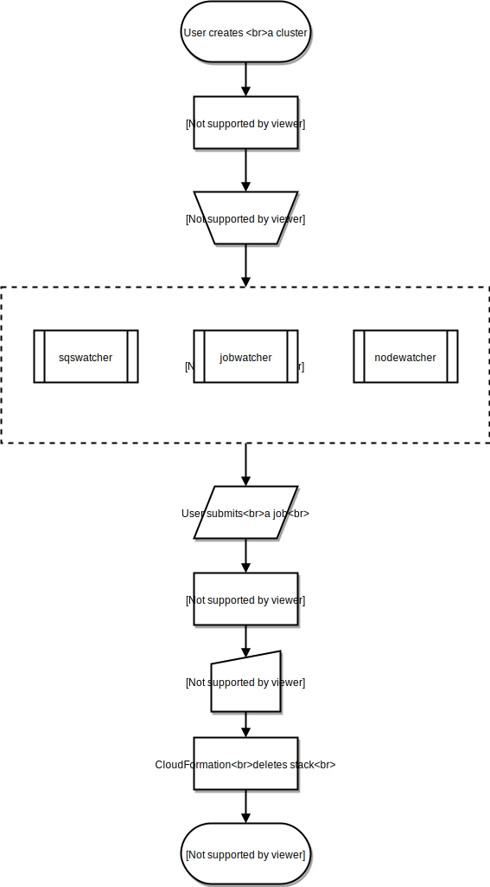
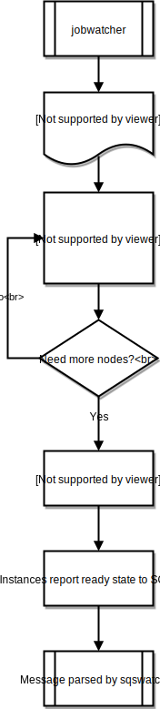
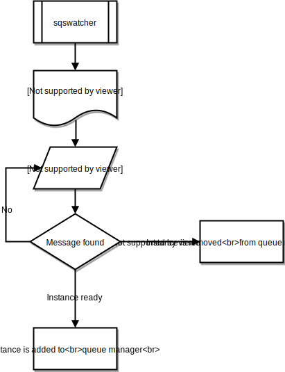
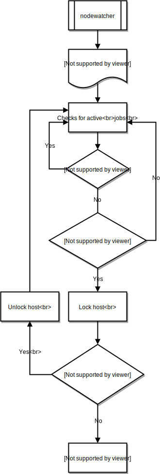

.. _processes:

AWS ParallelCluster Processes
=============================

This section applies only to HPC clusters deployed with one of the supported traditional job scheduler,
either SGE, Slurm or Torque.
In these cases AWS ParallelCluster manages the compute node provisioning and removal
by interacting with both the Auto Scaling Group (ASG) and the underlying job scheduler.
For HPC clusters based on AWS Batch, ParallelCluster totally relies on the capabilities
provided by the AWS Batch for the compute node management.

.. toctree::

General Overview
----------------
A cluster's life cycle begins after it is created by a user.
Typically, this is done from the Command Line Interface (CLI).
Once created, a cluster will exist until it's deleted.
There are then AWS ParallelCluster daemons running on the cluster nodes mainly
aimed to manage the HPC cluster elasticity.
Here below a diagram representing the user's workflow and the cluster life cycle, while the next sections
describe the AWS ParallelClustr daemons used to manage the cluster.

jobwatcher
----------
Once a cluster is running, a process owned by the root user will monitor the configured scheduler (SGE, Torque, Slurm,
etc) and each minute, it'll evaluate the queue in order to decide when to scale up.

sqswatcher
----------
The sqswatcher process monitors for SQS messages emitted by Auto Scaling which notifies of state changes within the
cluster.  When an instance comes online, it will submit an "instance ready" message to SQS, which is picked up by
sqs_watcher running on the master server.  These messages are used to notify the queue manager when new instances come
online or are terminated, so they can be added or removed from the queue accordingly.

nodewatcher
-----------
The nodewatcher process runs on each node in the compute fleet.  After the user defined ``scaledown_idletime`` period,
the instance is terminated.

.. spelling::
    sqs
