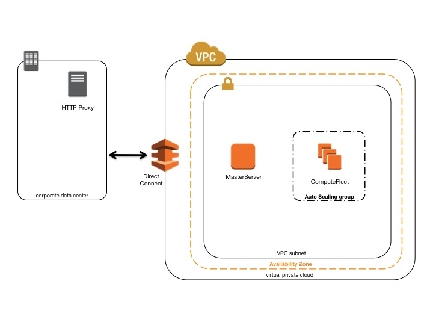

.. _networking:

Network Configurations
======================

cfncluster leverages Amazon Virtual Private Cloud(VPC) for networking. This provides a very flexiable and configurable networking platform to deploy clusters within. cfncluster support the following high-level configurations:

* Single subnet, master and compute in the same subnet
* Two subnets, master in one subnet and compute new private subnet
* Two subnets, master in one subnet and compute in exisiting private subnet

All of these configurations can operate with or without public IP addressing. It can also be deployed to leverage an HTTP proxy for all AWS requests. The combinations of these configurations result in many different deployment scenario's, ranging from a single public subnet with all access over the Internet, to fully private via AWS Direct Connect and HTTP proxy for all traffic.

Below are some architeture diagrams for some of those scenarios:

.. figure:: images/networking_single_subnet.jpg
   :alt: cfncluster single subnet

   cfncluster in a single public subnet

The configuration for this architecture, requires the following settings:

`note that all values are examples only`

::

  [vpc public]
  vpc_id = vpc-a1b2c3d4
  master_subnet_id = subnet-a1b2c3d4

.. figure:: images/networking_two_subnets.jpg
   :alt: cfncluster two subnets

   cfncluster using two subnets(new private)

The configuration for this architecture, requires the following settings:

`note that all values are examples only`

::

  [vpc public-private]
  vpc_id = vpc-a1b2c3d4
  master_subnet_id = subnet-a1b2c3d4
  compute_subnet_cidr = 10.0.1.0/24

   cfncluster in a private subnet connected using Direct Connect

The configuration for this architecture, requires the following settings:

`note that all values are examples only`

::

  [vpc private-dx]
  vpc_id = vpc-a1b2c3d4
  master_subnet_id = subnet-a1b2c3d4
  proxy_server = http://proxy.corp.net:8080
  use_public_ips = false
