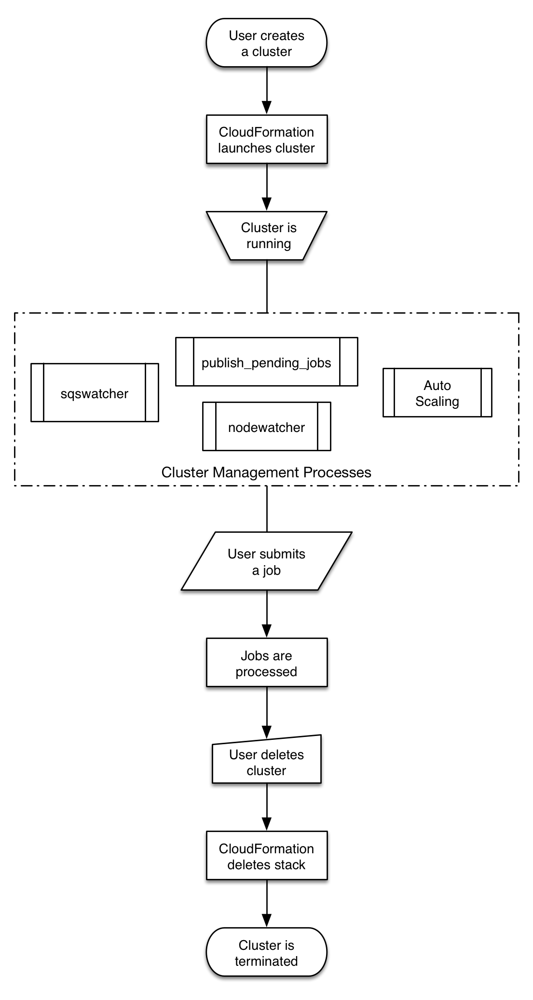
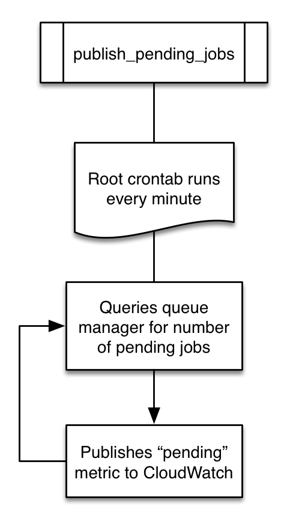
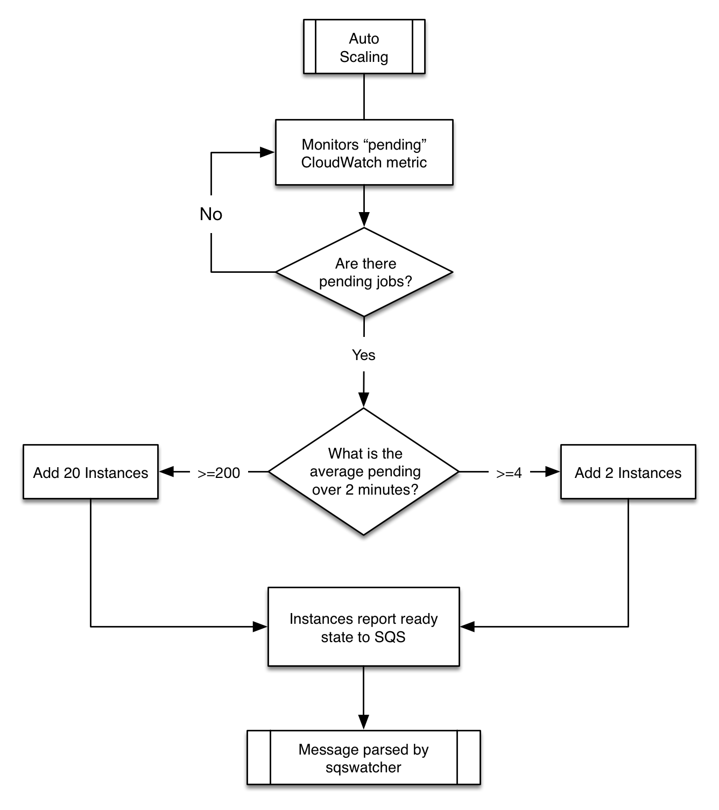
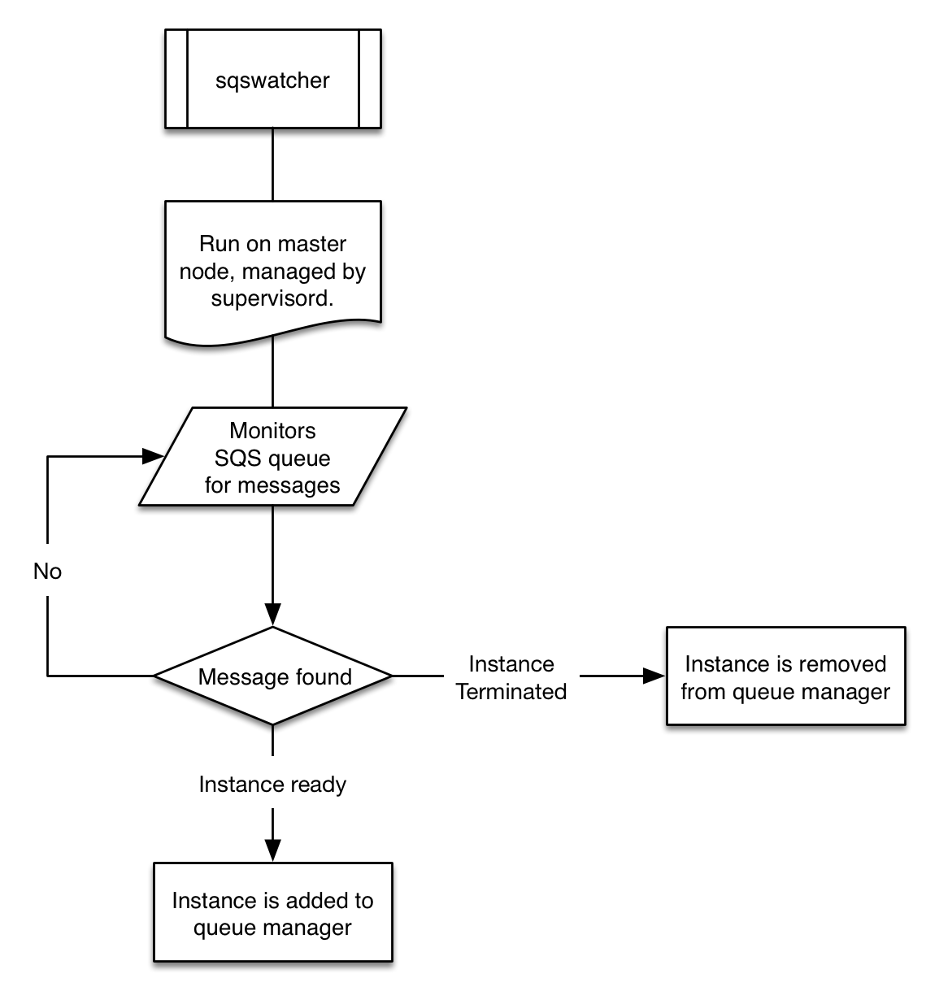

.. _processes:

CfnCluster Processes
====================
There are a number of processes running within CfnCluster which are used to manage it's behavior.

.. toctree::

General Overview
----------------
A cluster's lifecycle begins after it is created by a user.  Typically, this is done from the Command Line Interface (CLI).  Once created, a cluster will exist until it's deleted.

publish_pending_jobs
--------------------
Once a cluster is running, a cronjob owned by the root user will monitor the configured scheduler (SGE, Torque, Openlava, etc) and publish the number of pending jobs to CloudWatch.  This is the metric utilized by :ref:`Auto Scaling <auto_scaling>` to add more nodes to the cluster.

.. _auto_scaling:

Auto Scaling
------------
Auto Scaling, along with Cloudwatch alarms are used to manage the number of running nodes in the cluster.

The number of instances added, along with the thresholds in which to add them are all configurable via the :doc:`Scaling <configuration>` configuration section.

sqswatcher
-----------
The sqswatcher process monitors for SQS messages emitted by Auto Scaling which notifies of state changes within the cluster.  When an instance comes online, it will submit an "instance ready" message to SQS, which is picked up by sqs_watcher running on the master server.  These messages are used to notify the queue manager when new instances come online or are terminated, so they can be added or removed from the queue accordingly.

nodewatcher
------------
The nodewatcher process runs on each node in the compute fleet.  This process is used to determine when an instance is terminated.  Because EC2 is billed by the instance hour, this process will wait until an instance has been running for 95% of an instance hour before it is terminated.

.. image:: images/nodewatcher.png
    :align: center
    :width: 20%

