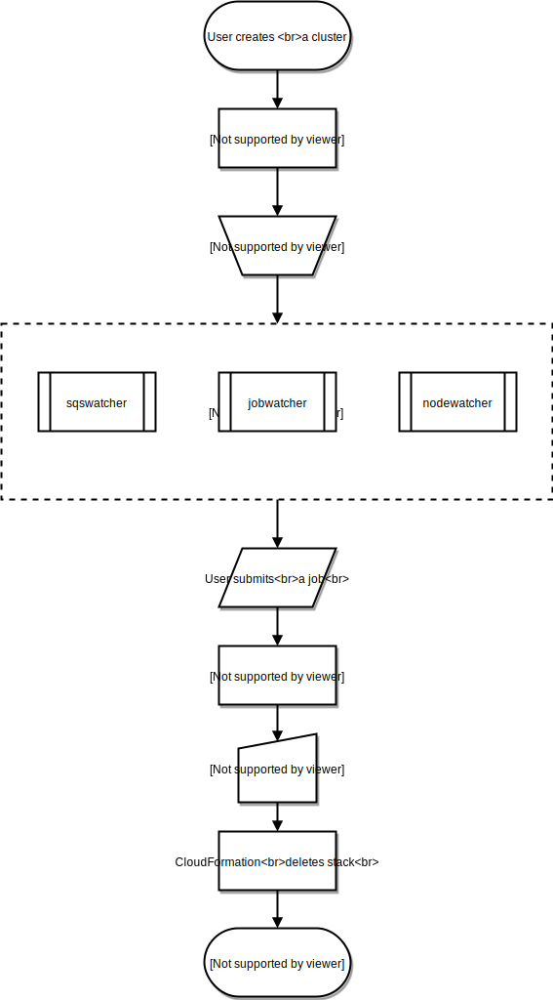
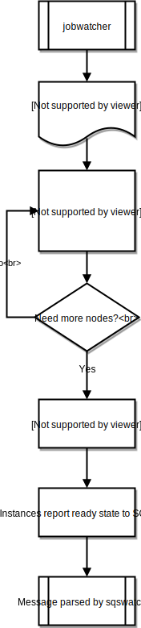
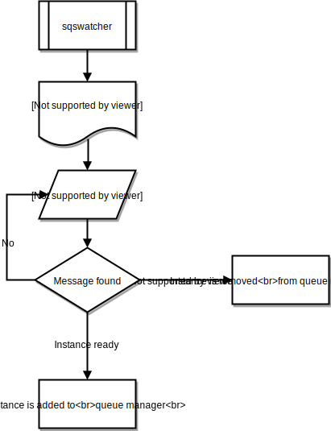
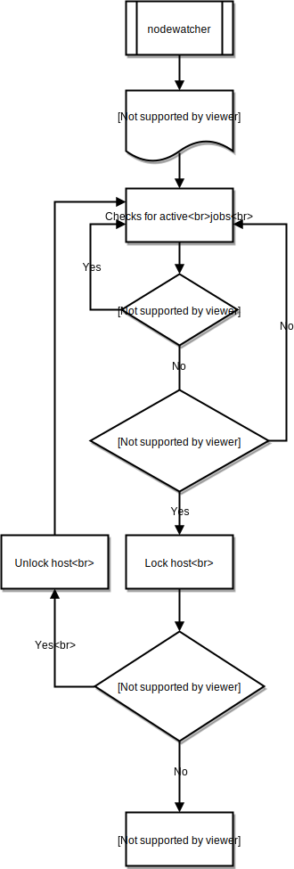

.. _processes:

CfnCluster Processes
====================
There are a number of processes running within CfnCluster which are used to manage it's behavior.

.. toctree::

General Overview
----------------
A cluster's lifecycle begins after it is created by a user.  Typically, this is done from the Command Line Interface (CLI).  Once created, a cluster will exist until it's deleted.

jobwatcher
----------
Once a cluster is running, a process owned by the root user will monitor the configured scheduler (SGE, Torque, Slurm, etc) and each minute, it'll evaluate the queue in order to decide when to scale up.

sqswatcher
-----------
The sqswatcher process monitors for SQS messages emitted by Auto Scaling which notifies of state changes within the cluster.  When an instance comes online, it will submit an "instance ready" message to SQS, which is picked up by sqs_watcher running on the master server.  These messages are used to notify the queue manager when new instances come online or are terminated, so they can be added or removed from the queue accordingly.

nodewatcher
-----------
The nodewatcher process runs on each node in the compute fleet.  After the user defined ``scaledown_idletime`` period, the instance is terminated.

